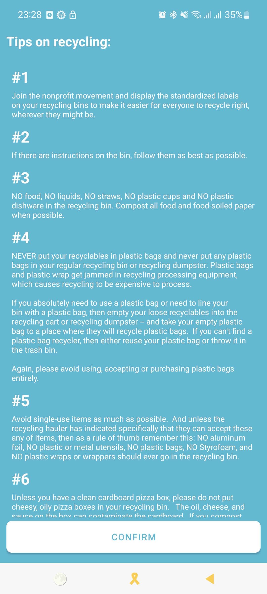
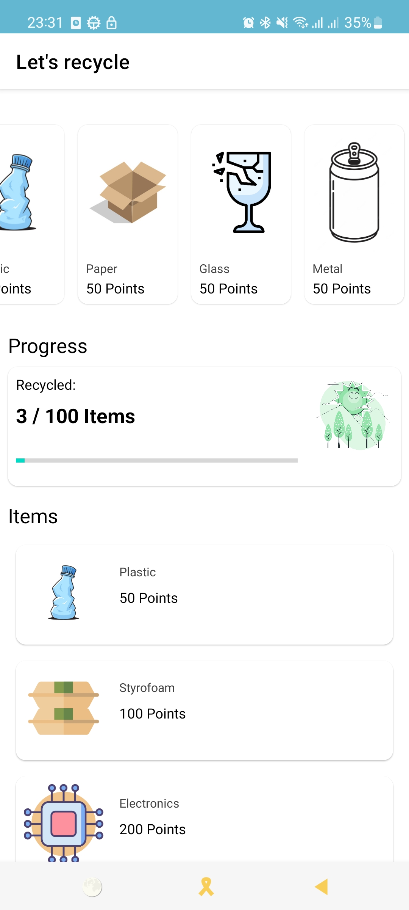
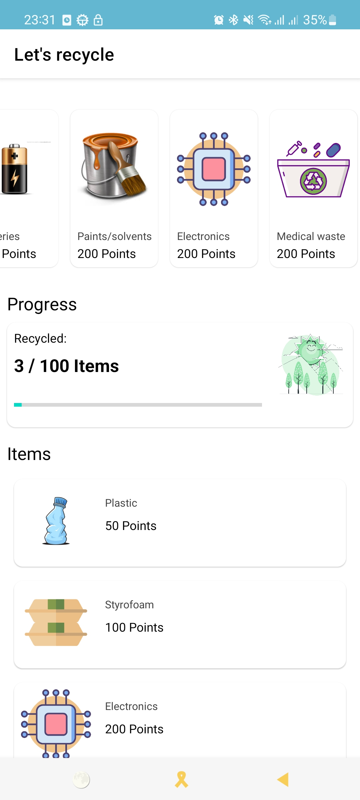

# Stack

* [Android Jetpack](https://developer.android.com/jetpack)
    * [Data Binding](https://developer.android.com/topic/libraries/data-binding/) The Data Binding Library is a support library that allows you to bind UI components in your layouts to data sources in your app using a declarative format rather than programmatically.
    * [Live Data](https://developer.android.com/topic/libraries/architecture/livedata) LiveData is lifecycle-aware, meaning it respects the lifecycle of other app components updating app component observers that are in an active lifecycle state.

* [Kotlin coroutines](https://developer.android.com/kotlin/coroutines) Executing code asynchronously.
* [Retrofit](https://square.github.io/retrofit/) Type-safe HTTP client for Android and Java and Kotlin by Square, Inc.
* [Gson](https://github.com/square/retrofit/tree/master/retrofit-converters/gson) A Converter which uses Gson for serialization to and from JSON.
* [OkHttp interceptor](https://github.com/square/okhttp/tree/master/okhttp-logging-interceptor) Logs HTTP requests and responses
* [Material Design](https://material.io/develop/android/) Build beautiful, usable products using Material Components for Android
* [JUnit4](https://junit.org/junit4/) Unit Testing
* [Espresso](https://developer.android.com/training/testing/espresso) Automated testing UI test
* [MockWebServer](https://github.com/square/okhttp/tree/master/mockwebserver) A scriptable web server for testing HTTP clients
* [Kakao](https://github.com/KakaoCup/Kakao) Nice and simple DSL for Espresso in Kotlin
* [MockK](https://mockk.io/) Mocking Library for Kotlin

# Demo

|
|
|